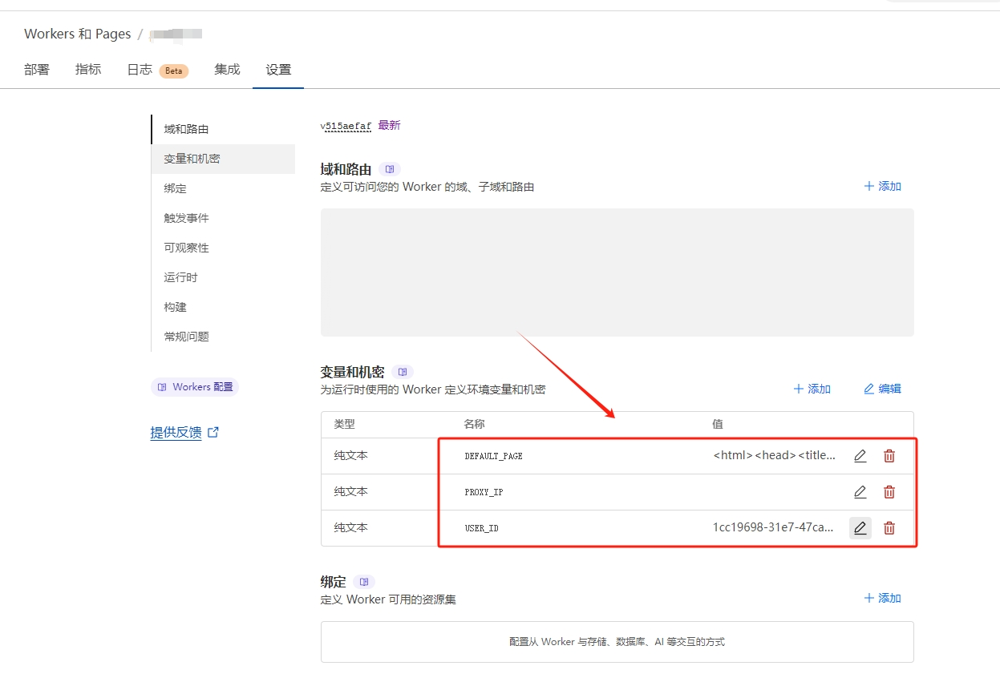

# 简介
[](https://deploy.workers.cloudflare.com)

这是一个基于 Cloudflare Workers 的隧道服务,用于解决一些不网络不通畅的问题。原始代码来自于:
<https://github.com/zhu327/workers-tunnel>
但是原始代码，由于Cloudflare Workers的封锁，无法正常使用。`会出现1101错误`。
于是我在原项目的基础上进行了一点点修改，诞生了本项目。
# 使用方法
## 1.部署服务端
### 1.1 Cloudflare Workers 网站部署
    自行百度搜索Cloudflare Workers部署教程。
### 1.2 源码部署
    参考官方文档
    <https://developers.cloudflare.com/workers/languages/rust/>
## 2.服务器配置
### 2.1 在Cloudflare Workers管理页添加修改配置

### 2.2 通过wrangler.toml修改配置
```toml
[vars]
USER_ID = "4ab2748d-8b29-4b3a-a53b-4509222c8612" #用户ID
PROXY_IP = ""
DEFAULT_PAGE = "<html><head><title>啦啦啦</title></head><body><h1>Hello, world!</h1></body></html>" #默认页提示
```
## 2.客户端
客户端使用Xray
<https://github.com/XTLS/Xray-core>

## 订阅地址
   默认订阅地址:https://你的Worker名.你的用户名.workers.dev/USER_ID
   (其实就是你的域名后面你配置的`/USER_ID`,例如https://a.b.workers.dev/1cc19698-31e7-47ca-a29b-34b6b1ded557)
# Cloudflare Workers域名被封的解决方法
如果你没有自己的与域名那么Cloudflare给的(https://你的Worker名.你的用户名.workers.dev)大概率用不了。
其实可以使用Cloudflare的pages服务来做中转。使用*.pages.dev域名。来访问。具体操作方法请自行百度。